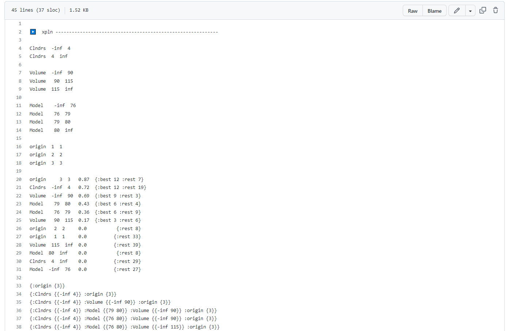

<!--  -->

## This is the README file of HW5-xpln (CSC 591, 2023)
Since this work is based on previous HWs, we do not explain details, in order to make it clear enough.

## Expected result:

* [Expected result](https://github.com/timm/tested/blob/main/etc/out/xpln.out):

(the result is too long to have a screen capture)

## Result:

* [result](https://github.com/yzhu27/xpln/blob/main/etc/out/xpln.out):

(same reason)